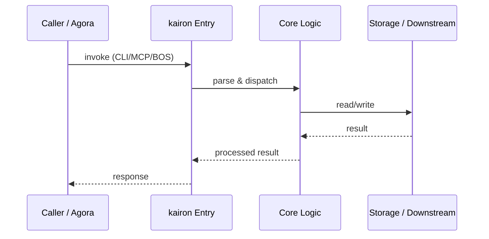
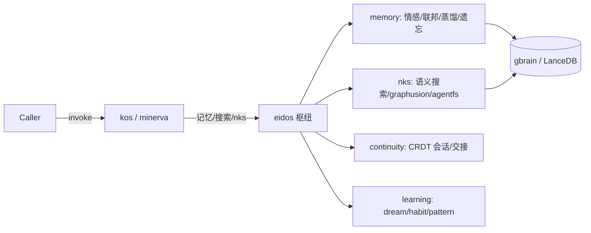

# kairon — Call Chain

> 本文档描述 kairon 内部最核心的一条调用链 / 数据流。
>
> 通用跨层调用链参见：[`../../docs/I0-AGORA-CALLCHAIN.md`](../../docs/I0-AGORA-CALLCHAIN.md)

---

## 关键路径

1. 1. Agora routes `bos://memory/kos/search` to kos CLI via stdio
2. 2. `kos.cli` parses args, loads index/config, executes hybrid search
3. 3. For deep research, `minerva` may call `ontoderive` or `codeanalyze` internally
4. 4. `eidos` validates schemas before persistence
5. 5. Results returned as JSON via stdio → agora → caller

## Sequence Diagram

## eidos 认知记忆枢纽数据流 (kairon 真核心)

eidos 是 kairon 认知记忆枢纽 (39K LOC, 被最多包依赖), 但旧 CALLCHAIN 5 步没提.
真实数据流:

1. kos/minerva 接 caller (via agora BOS `bos://memory/*` / `bos://analysis/*`)
2. kos/minerva 调 eidos memory/nks (记忆召回 / 语义搜索 / graphusion)
3. eidos memory/nks → gbrain/LanceDB (向量存储 + 检索)
4. eidos continuity 维护会话 CRDT (跨域一致性, handover/conflict)
5. eidos learning 后台 (dream/habit/pattern/preference 认知学习, 非阻塞)
6. 结果回 kos/minerva → caller (JSON via stdio → agora)

**关键**: eidos schema (类型/注册/迁移) 只是数据建模子集, 主体是 memory/nks/continuity/learning.
详见 CAPABILITY-MAP.md "引擎层 eidos" + ARCHITECTURE.md 核心模块表.
