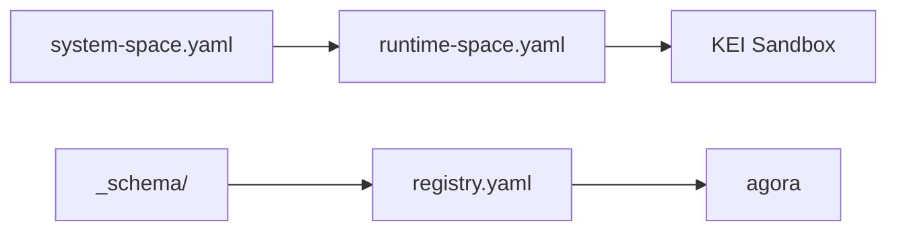

# spaces — Architecture

> **Layer**: L0/L1 跨切  
> **Role**: 空间配置层 — user-space / tenant-space manifests / admission matrices  
> **Stack**: Pure YAML  
> **Health**: No code tests; validate via integration tests
>
> 系统全景参见：[`docs/ARCHITECTURE-DIAGRAM.md`](../docs/ARCHITECTURE-DIAGRAM.md)

---

## 1. 内部架构



## 2. 入口

| Type | Entry | Port / Notes |
|:--|:--|:--|
| Config | `registry.yaml, system-space.yaml, runtime-space.yaml` |  |

## 3. 核心模块

| Module | Responsibility |
|:--|:--|
| `registry.yaml` | Space registry |
| `system-space.yaml` | System space manifest |
| `runtime-space.yaml` | Runtime space manifest |
| `_schema/space-manifest.schema.yaml` | Schema |
| `_schema/space-identity-admission.schema.yaml` | Admission schema |

## 4. 测试

```bash
bash tests/integration/run-all.sh
```
