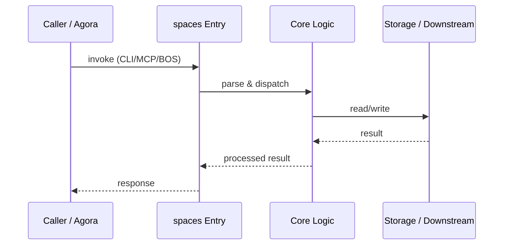

# spaces — Call Chain

> 本文档描述 spaces 内部最核心的一条调用链 / 数据流。
>
> 通用跨层调用链参见：[`docs/I0-AGORA-CALLCHAIN.md`](../docs/I0-AGORA-CALLCHAIN.md)

---

## 关键路径

1. 1. `agora` loads space registry for routing decisions
2. 2. `runtime` reads runtime-space manifests for KEI admission
3. 3. Admission matrices define which capabilities can run in which space
4. 4. Rollout policies govern staged enablement

## Sequence Diagram

